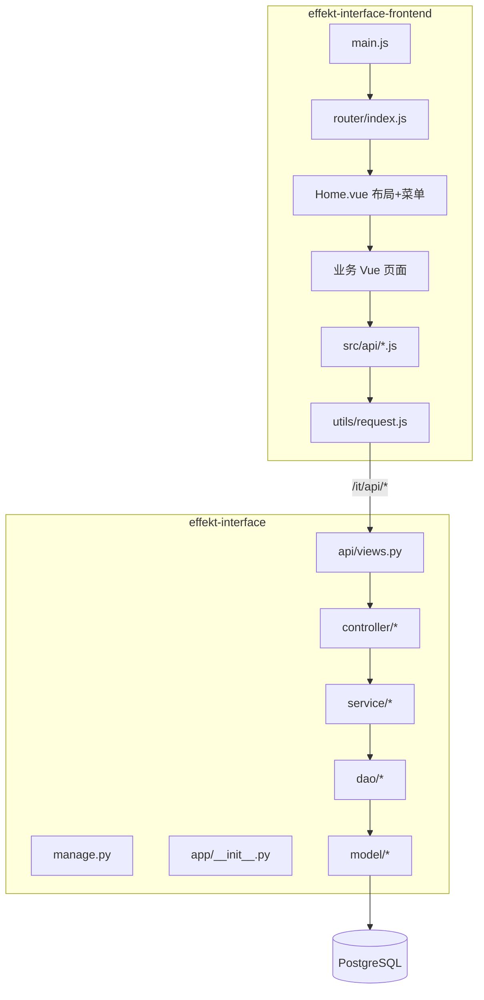

# Effekt 全栈新人上手指南

使用说明：


技术文档：

**仓库**
- 后端：`\effekt-interface`
- 前端：`\effekt-interface-frontend`

---

## 一、项目概览

### 系统定位

**Effekt** 是一套测试协作与效能管理平台，覆盖测试用例、计划、自动化执行、缺陷、RBAC、Mock 接口、数据构造与 AI 辅助用例生成。

| 维度 | 后端 | 前端 |
|------|------|------|
| **技术栈** | Python、Flask、SQLAlchemy、Gunicorn | Vue 2、Vue Router、Vuex、Element UI、Webpack 3、Axios |
| **入口** | `manage.py` → `app/__init__.py` | `src/main.js` → `App.vue` |
| **API 前缀** | `/it/api`（蓝图） | `baseURL: '/it/api'`（`src/utils/request.js`） |
| **本地端口** | 5010（Gunicorn / `manage.py`） | 8081（webpack-dev-server） |
| **数据库** | PostgreSQL（`const.py` / `.env`） | — |

### 联调方式

```
浏览器 :8081  →  webpack proxy `/it/api`  →  后端 :5010
```

开发代理在 `effekt-interface-frontend/config/index.js`：

```javascript
proxyTable: {
  '/it/api': {
    target: 'http://127.0.0.1:5010',  // 按环境改成本机 127.0.0.1:5010
    changeOrigin: true
  }
}
```

### 快速启动

**后端**
```bash
cd \effekt-interface
pip3 install -r requirements.txt
# 配置 .env / const.py 中的数据库等
gunicorn --config=gunicorn.conf.py manage:app
```

**前端**
```bash
cd \effekt-interface-frontend
npm install
npm run dev   # http://localhost:8081
```

---

## 二、全栈架构总览



**请求链路：** 页面 → `*Api.js` → `request.js`（Token + 错误码）→ 后端 `views.py` → Controller → Service → DAO → Model

---

## 三、后端架构（effekt-interface）

### 分层（9 层，168 个文件级节点）

| 层级 | 职责 | 代表路径 |
|------|------|----------|
| **API** | 路由与 HTTP 控制器 | `app/api/views.py`、`app/api/controller/*` |
| **Middleware** | JWT、权限装饰器 | `app/api/utils/authMiddleware.py` |
| **Service** | 业务逻辑 | `app/api/service/*` |
| **Data** | DAO、ORM、SQL 脚本 | `app/api/dao/*`、`app/api/model/*`、`resources/sql/` |
| **Utility** | 公共能力 | `common/sqlSession.py`、`jenkinsRequest.py` |
| **Configuration** | 启动与配置 | `manage.py`、`const.py`、`config/ai_config.py`、`.env` |
| **Infrastructure** | 部署 | `Dockerfile`、`Jenkinsfile` |
| **Documentation** | 设计与 API 文档 | `.plan/`、`resources/*_api_doc.md` |
| **Test** | 临时脚本 | `test_fix.py` |

### 核心模式

- **垂直切片：** `controller → service → dao → model`
- **基类：** `BaseCrudController`（Session、参数、JSON 序列化）
- **认证：** `authMiddleware` + `accessToken` 请求头
- **业务域：** case / plan / automation / bug / mock / rbac / project / document / skill

### 后端复杂度热点（修改前必读）

| 文件 | 说明 |
|------|------|
| `app/api/views.py` | 全部 REST 路由注册 |
| `automationService.py` | Jenkins 自动化编排（最大 Service） |
| `caseController.py` / `caseDao.py` | 用例树、导入、快照 |
| `mockService.py` 等 6 个 mock*Service | Mock 子系统 |
| `authMiddleware.py` | 登录与权限 |
| `common/sqlSession.py` | 24+ 模块依赖 |

**高扇入依赖：** `logger.py`、`sqlSession.py`、`const.py`、`baseCrudController.py`

---

## 四、前端架构（effekt-interface-frontend）

### 目录结构

```
src/
├── main.js              # 入口：Vue + ElementUI + Router + Vuex
├── App.vue
├── router/index.js      # 全部路由（history 模式）
├── vuex/store.js        # 用户、角色、菜单
├── utils/
│   ├── request.js       # Axios 封装（/it/api、Token、451 续期）
│   ├── authToken.js     # 静默 refresh
│   └── lastProductProjectCache.js  # 产品/项目上下文缓存
├── api/                 # 按域拆分的 API 模块（14 个）
└── components/
    ├── Home.vue         # 壳：侧栏菜单 + 顶栏 + router-view
    ├── User/            # 登录注册
    ├── TestPlatform/    # 用例、计划、项目、报告、数据工厂
    ├── Bug/             # 缺陷
    ├── Mock/            # Mock 文档/接口/日志
    ├── System/          # RBAC 管理
    ├── CreateData/      # 数据构造（旧模块）
    └── DataMonitor/     # 监控视图
```

### 前端分层逻辑

| 层级 | 职责 | 关键文件 |
|------|------|----------|
| **入口与壳** | 启动、主题、布局 | `main.js`、`Home.vue` |
| **路由** | URL → 页面 | `router/index.js` |
| **状态** | 登录用户、动态菜单 | `vuex/store.js` + `localStorage` |
| **HTTP** | 统一请求与鉴权 | `utils/request.js`、`authToken.js` |
| **API 客户端** | 后端路径封装 | `src/api/*.js` |
| **页面** | 业务 UI | `components/**/*.vue` |

### API 模块与后端域对应

| 前端 API 文件 | 主要后端路径前缀 | 业务 |
|---------------|------------------|------|
| `Userapi.js` | `/auth/*`、`/manageSystem/user/*` | 登录、注册、用户管理 |
| `rbacApi.js` | 角色/权限/菜单 | RBAC |
| `projectApi.js` | `/project/*` | 项目、环境、成员、Webhook |
| `productApi.js` | `/product/*` | 产品 |
| `caseApi.js` | `/module/*`、`/case/*` | 用例与模块树 |
| `planApi.js` | `/plan/*` | 测试计划 |
| `automationApi.js` | 自动化执行 | Jenkins 自动化 |
| `bugApi.js` | 缺陷相关 | Bug 跟踪 |
| `reportApi.js` | 报告 | 测试报告 |
| `documentApi.js` | 文档源 | 需求文档 + AI |
| `skillRuleApi.js` | Skills/规则 | AI 技能配置 |
| `mockApi.js` | `/mock/*` | Mock（部分直连 axios） |
| `dataFactoryApi.js` | 数据构造器 | Data Builder |
| `CreateDtapi.js` | 造数（旧） | CreateData 模块 |

### 认证与错误码约定（前后端契约）

前端 `request.js` 与后端 `apiResponse` 约定：

| code | 前端行为 |
|------|----------|
| `20000` | 成功 |
| `40001` | 缺少 Token → 跳转登录 |
| `451` | Token 过期 → `auth/refresh` 静默续期后重试 |
| `40003` | 无权限提示 |
| `500` | 服务异常 |

Token 放在请求头 `accessToken`（与后端 `authMiddleware` 一致）。

### 动态菜单

`Home.vue` 从 Vuex `userMenus`（登录后写入 `localStorage`）渲染侧栏，与后端 RBAC 菜单树对应；路由在 `router/index.js` 中静态注册，菜单控制可见性。

### 前端复杂度热点（按代码行数）

| 文件 | 约行数 | 说明 |
|------|--------|------|
| `CaseList.vue` | **2755** | 用例列表（最大页面，优先熟悉） |
| `BugDetail.vue` | 1498 | 缺陷详情 |
| `PlanList.vue` | 954 | 计划列表 |
| `DocumentSourcePanel.vue` | 999 | 文档源 / AI 生成 |
| `PlanAutomationRun.vue` | 842 | 自动化执行 |
| `BusinessSkillRuleConfig.vue` | 820 | 技能与业务规则 |
| `BugEditor.vue` | 815 | 缺陷编辑 |
| `Home.vue` | 761 | 全局布局与菜单 |

---

## 五、业务模块全栈对照

| 功能 | 前端路由（示例） | 前端页面/API | 后端 Controller/Service |
|------|------------------|--------------|-------------------------|
| 登录 | `/Login` | `Login.vue`、`Userapi.js` | `userController`、`authMiddleware` |
| 首页 | `/effekt` | `EffektHome.vue` | — |
| 项目/产品 | `/test-platform/project` | `ProjectList.vue`、`projectApi.js` | `projectController`、`productController` |
| 用例 | `/test-platform/case` | `CaseList.vue`、`caseApi.js` | `caseController`、`caseService` |
| 计划 | `/test-platform/plan` | `PlanList.vue`、`planApi.js` | `planController`、`planService` |
| 自动化 | `/test-platform/plan/automation` | `PlanAutomationRun.vue`、`automationApi.js` | `automationController`、`automationService` |
| 缺陷 | `/bug/list` | `BugList.vue`、`bugApi.js` | `bugController`、`bugService` |
| 报告 | `/test-platform/report` | `ReportList.vue`、`reportApi.js` | `reportController` |
| Mock | `/mock/document` 等 | `Mock/*.vue`、`mockApi.js` | `mockController`、`mock*Service` |
| RBAC | `/system/role` 等 | `System/*.vue`、`rbacApi.js` | `rbacController`、`rbacService` |
| 技能规则 | `/test-platform/skill-rules` | `BusinessSkillRuleConfig.vue` | `skillController`、`skillService` |
| 数据工厂 | `/data-tools/factory` | `BuilderList.vue`、`dataFactoryApi.js` | `dataBuilderController` |

---

## 六、推荐学习路径（全栈）

| 步骤 | 主题 | 后端 | 前端 |
|------|------|------|------|
| 1 | 环境与联调 | `README.md`、`.env`、`const.py` | `config/index.js` 代理、`npm run dev` |
| 2 | 启动链路 | `manage.py` → `app/__init__.py` | `main.js` → `App.vue` |
| 3 | 路由总表 | `app/api/views.py` | `router/index.js` |
| 4 | 认证 | `authMiddleware.py` | `request.js`、`authToken.js`、`Login.vue` |
| 5 | 布局与菜单 | — | `Home.vue`、`store.js` |
| 6 | 用例（样板） | case 四层 | `CaseList.vue` + `caseApi.js` |
| 7 | 计划与自动化 | plan + automation | `PlanList.vue`、`PlanAutomationRun.vue` |
| 8 | Mock | mock* | `Mock/*.vue`、`mockApi.js` |
| 9 | RBAC | rbac* | `System/*.vue` |
| 10 | 部署 | `Dockerfile`、`Jenkinsfile` | `npm run build` → 静态资源 |

---

## 七、关键文件地图（精简）

### 后端必看

- `manage.py`、`app/__init__.py` — 应用工厂
- `app/api/views.py` — 所有 API
- `app/api/controller/baseCrudController.py` — Controller 基类
- `common/sqlSession.py`、`const.py`、`logger.py` — 基础设施
- `config/ai_config.py` — AI 配置

### 前端必看

- `src/main.js`、`src/router/index.js`
- `src/utils/request.js`、`src/utils/authToken.js`
- `src/components/Home.vue`
- `src/api/caseApi.js`（API 封装范例）
- `src/components/TestPlatform/Case/CaseList.vue`（最复杂页面）

---

## 八、后续建议

1. **生成正式知识图谱**（推荐）  
   ```text
   /understand --language zh
   /understand \effekt-interface-frontend --language zh
   ```
   

   完成后可用 `/understand-dashboard` 可视化，并用 `/understand-onboard` 自动带出 Tour。

2. **统一代理地址** — 本地开发将 `config/index.js` 的 `target` 改为 `http://127.0.0.1:5010`，与 `const.py` 中 `BE_URL` 一致。

3. **保存文档** — 可将本文保存为 `effekt-interface/docs/ONBOARDING.md`（或 monorepo 根目录），提交给团队。

4. **安全提醒** — `const.py` 含数据库等敏感配置，勿提交到公开仓库；前端代理 IP 按团队环境维护。


使用说明：


