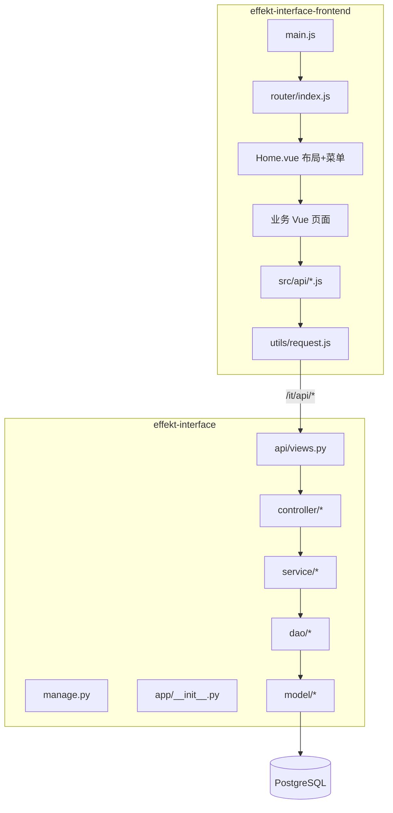

# Effekt 全栈新人上手指南

使用说明：
一、登录与注册
系统支持账号登录与注册，并提供主题换肤能力，用户可根据使用习惯切换界面配色。


二、首页
首页集中展示当日剩余未解决 Bug 和未完成测试计划，便于用户快速了解当前测试工作进度。


三、用例周期
1. 产品管理
支持新增产品，并可在对应产品下继续新增项目，实现产品与项目的统一维护。


2. 项目管理
项目由产品创建后，可继续维护项目成员、环境配置和 Hook 配置。Hook 支持飞书、钉钉和企业微信，可用于测试计划、冒烟测试和 Bug 通知等场景。例如开发人员提测后，可创建开发冒烟计划，并通过飞书通知指定人员执行；Bug 也支持按项目配置进行定制化消息推送。


3. 用例管理
用例管理包含用例模块、用例列表、用例脑图和 AI 生成用例。
用例模块支持手动新增，也支持在 AI 生成用例审核通过后自动生成对应模块，便于后续统一归类和维护。


用例列表支持自定义查询条件和自定义表头展示。用户可手动新增用例，也可通过 Excel 模板批量导入，模板格式与禅道用例模板类似。列表中还支持生成自动化用例，选择 UI 自动化或接口自动化后，系统会调用自动化框架 API 和大模型 Agent，通过预置 Skills 按要求生成可持续维护、可执行的自动化用例，减少人工介入成本。


用例脑图采用类似 XMind 的树形结构，主要用于用例评审。只有评审通过的用例，才可在创建测试执行计划时被选择；评审过程中也支持对用例进行编辑。


AI 生成用例支持批量上传 PRD，并可选择 Skills 和业务规则共同参与生成。若需要生成特定类型的异常用例，可在 Skills 与业务规则配置中维护要求；对于 PRD 中未覆盖的业务规则，也可单独维护到规则库中，在生成用例时一并引用。未选择配置时，系统默认按四层结构的通用 Skills 生成用例；AI 生成结果审核通过后，可同步到用例列表。


4. 测试计划


创建计划时支持测试执行计划和自动化计划。测试执行计划创建后，需要关联当前项目下已评审通过的用例。


执行过程中可记录执行结果；当用例执行失败时，可填写失败原因，后续报表统计会汇总展示相关结果。


用户可随时在列表中查看计划执行进度，了解当前用例执行完成情况。


列表中的“发送消息”功能会根据当前项目配置的 Hook，将计划或执行信息推送到对应通知渠道。


自动化计划创建时需要填写 Jenkins Job 地址。当前自动化执行基于 Pytest 框架，点击执行自动化测试后，系统会筛选当前项目下已评审通过且“是否实现自动化”为“是”的用例。选择用例后执行，系统会将用例编号作为 Allure Story 标签传入自动化任务，执行完成后在结果列表中展示执行结果。


5. 测试报告
测试报告用于展示计划执行后的结果数据，可根据不同团队的展示习惯进行定制化开发，目前主要返回并展示对应的执行结果数据。


6. 配置技能与规则


该模块用于维护 AI 生成用例时使用的 Skills 技能和业务规则。同时，后台会将出现超过 2 次的同类型线上问题沉淀为业务规则，在生成回归测试用例时，AI 模型会结合 Bug 影响范围生成更全面的测试用例。

四、Bug 管理


Bug 提交流程与禅道、Jira 等常见缺陷管理工具一致，并支持生成图表进行统计展示。


五、造数工具


数据库造数支持按项目和环境配置数据库连接，用户输入 SQL 后即可执行造数操作。


造数工厂可根据已完成的自动化关键字进行组装，支持 Mock、流程编排和脚本等方式，满足不同测试数据准备场景。


六、Mock 服务
Mock 服务支持导入接口文档或接口地址，也支持拉取 Git 仓库代码。无论前端还是后端代码，系统都可通过大模型进行分析总结，并生成对应 Mock 数据。针对微服务场景，还支持请求透传，需要在发布的微服务上配置并转发到效能平台服务。


同一个 Mock 接口支持配置多种返回方式，异常场景也可按需新增，只需维护对应返回模板即可。


系统支持查看每次 Mock 接口的调用日志，便于排查调用记录和返回结果。


七、系统管理


系统管理用于维护效能平台的权限体系，支持目录、菜单、按钮级权限控制，同时支持数据权限。管理员可为角色分配权限，再将角色分配给对应人员。

备注
后续将上线知识库能力：上传文档后，系统会统一存储到指定目录，并进行向量化处理和检索。用户提问时，系统可在所有文档中筛选相关内容并返回答案；本地回答会先通过 grep 定位，再结合 RAG 返回对应位置和上下文。如果需要总结、理解或生成答案，则调用大模型进行回答。对于需求量较多的业务，可建立专属业务知识库，提升检索和问答效率。


技术文档：

**仓库**
- 后端：`\effekt-interface`
- 前端：`\effekt-interface-frontend`

---

## 一、项目概览

### 系统定位

**Effekt** 是一套测试协作与效能管理平台，覆盖测试用例、计划、自动化执行、缺陷、RBAC、Mock 接口、数据构造与 AI 辅助用例生成。

| 维度 | 后端 | 前端 |
|------|------|------|
| **技术栈** | Python、Flask、SQLAlchemy、Gunicorn | Vue 2、Vue Router、Vuex、Element UI、Webpack 3、Axios |
| **入口** | `manage.py` → `app/__init__.py` | `src/main.js` → `App.vue` |
| **API 前缀** | `/it/api`（蓝图） | `baseURL: '/it/api'`（`src/utils/request.js`） |
| **本地端口** | 5010（Gunicorn / `manage.py`） | 8081（webpack-dev-server） |
| **数据库** | PostgreSQL（`const.py` / `.env`） | — |

### 联调方式

```
浏览器 :8081  →  webpack proxy `/it/api`  →  后端 :5010
```

开发代理在 `effekt-interface-frontend/config/index.js`：

```javascript
proxyTable: {
  '/it/api': {
    target: 'http://127.0.0.1:5010',  // 按环境改成本机 127.0.0.1:5010
    changeOrigin: true
  }
}
```

### 快速启动

**后端**
```bash
cd \effekt-interface
pip3 install -r requirements.txt
# 配置 .env / const.py 中的数据库等
gunicorn --config=gunicorn.conf.py manage:app
```

**前端**
```bash
cd \effekt-interface-frontend
npm install
npm run dev   # http://localhost:8081
```

---

## 二、全栈架构总览



**请求链路：** 页面 → `*Api.js` → `request.js`（Token + 错误码）→ 后端 `views.py` → Controller → Service → DAO → Model

---

## 三、后端架构（effekt-interface）

### 分层（9 层，168 个文件级节点）

| 层级 | 职责 | 代表路径 |
|------|------|----------|
| **API** | 路由与 HTTP 控制器 | `app/api/views.py`、`app/api/controller/*` |
| **Middleware** | JWT、权限装饰器 | `app/api/utils/authMiddleware.py` |
| **Service** | 业务逻辑 | `app/api/service/*` |
| **Data** | DAO、ORM、SQL 脚本 | `app/api/dao/*`、`app/api/model/*`、`resources/sql/` |
| **Utility** | 公共能力 | `common/sqlSession.py`、`jenkinsRequest.py` |
| **Configuration** | 启动与配置 | `manage.py`、`const.py`、`config/ai_config.py`、`.env` |
| **Infrastructure** | 部署 | `Dockerfile`、`Jenkinsfile` |
| **Documentation** | 设计与 API 文档 | `.plan/`、`resources/*_api_doc.md` |
| **Test** | 临时脚本 | `test_fix.py` |

### 核心模式

- **垂直切片：** `controller → service → dao → model`
- **基类：** `BaseCrudController`（Session、参数、JSON 序列化）
- **认证：** `authMiddleware` + `accessToken` 请求头
- **业务域：** case / plan / automation / bug / mock / rbac / project / document / skill

### 后端复杂度热点（修改前必读）

| 文件 | 说明 |
|------|------|
| `app/api/views.py` | 全部 REST 路由注册 |
| `automationService.py` | Jenkins 自动化编排（最大 Service） |
| `caseController.py` / `caseDao.py` | 用例树、导入、快照 |
| `mockService.py` 等 6 个 mock*Service | Mock 子系统 |
| `authMiddleware.py` | 登录与权限 |
| `common/sqlSession.py` | 24+ 模块依赖 |

**高扇入依赖：** `logger.py`、`sqlSession.py`、`const.py`、`baseCrudController.py`

---

## 四、前端架构（effekt-interface-frontend）

### 目录结构

```
src/
├── main.js              # 入口：Vue + ElementUI + Router + Vuex
├── App.vue
├── router/index.js      # 全部路由（history 模式）
├── vuex/store.js        # 用户、角色、菜单
├── utils/
│   ├── request.js       # Axios 封装（/it/api、Token、451 续期）
│   ├── authToken.js     # 静默 refresh
│   └── lastProductProjectCache.js  # 产品/项目上下文缓存
├── api/                 # 按域拆分的 API 模块（14 个）
└── components/
    ├── Home.vue         # 壳：侧栏菜单 + 顶栏 + router-view
    ├── User/            # 登录注册
    ├── TestPlatform/    # 用例、计划、项目、报告、数据工厂
    ├── Bug/             # 缺陷
    ├── Mock/            # Mock 文档/接口/日志
    ├── System/          # RBAC 管理
    ├── CreateData/      # 数据构造（旧模块）
    └── DataMonitor/     # 监控视图
```

### 前端分层逻辑

| 层级 | 职责 | 关键文件 |
|------|------|----------|
| **入口与壳** | 启动、主题、布局 | `main.js`、`Home.vue` |
| **路由** | URL → 页面 | `router/index.js` |
| **状态** | 登录用户、动态菜单 | `vuex/store.js` + `localStorage` |
| **HTTP** | 统一请求与鉴权 | `utils/request.js`、`authToken.js` |
| **API 客户端** | 后端路径封装 | `src/api/*.js` |
| **页面** | 业务 UI | `components/**/*.vue` |

### API 模块与后端域对应

| 前端 API 文件 | 主要后端路径前缀 | 业务 |
|---------------|------------------|------|
| `Userapi.js` | `/auth/*`、`/manageSystem/user/*` | 登录、注册、用户管理 |
| `rbacApi.js` | 角色/权限/菜单 | RBAC |
| `projectApi.js` | `/project/*` | 项目、环境、成员、Webhook |
| `productApi.js` | `/product/*` | 产品 |
| `caseApi.js` | `/module/*`、`/case/*` | 用例与模块树 |
| `planApi.js` | `/plan/*` | 测试计划 |
| `automationApi.js` | 自动化执行 | Jenkins 自动化 |
| `bugApi.js` | 缺陷相关 | Bug 跟踪 |
| `reportApi.js` | 报告 | 测试报告 |
| `documentApi.js` | 文档源 | 需求文档 + AI |
| `skillRuleApi.js` | Skills/规则 | AI 技能配置 |
| `mockApi.js` | `/mock/*` | Mock（部分直连 axios） |
| `dataFactoryApi.js` | 数据构造器 | Data Builder |
| `CreateDtapi.js` | 造数（旧） | CreateData 模块 |

### 认证与错误码约定（前后端契约）

前端 `request.js` 与后端 `apiResponse` 约定：

| code | 前端行为 |
|------|----------|
| `20000` | 成功 |
| `40001` | 缺少 Token → 跳转登录 |
| `451` | Token 过期 → `auth/refresh` 静默续期后重试 |
| `40003` | 无权限提示 |
| `500` | 服务异常 |

Token 放在请求头 `accessToken`（与后端 `authMiddleware` 一致）。

### 动态菜单

`Home.vue` 从 Vuex `userMenus`（登录后写入 `localStorage`）渲染侧栏，与后端 RBAC 菜单树对应；路由在 `router/index.js` 中静态注册，菜单控制可见性。

### 前端复杂度热点（按代码行数）

| 文件 | 约行数 | 说明 |
|------|--------|------|
| `CaseList.vue` | **2755** | 用例列表（最大页面，优先熟悉） |
| `BugDetail.vue` | 1498 | 缺陷详情 |
| `PlanList.vue` | 954 | 计划列表 |
| `DocumentSourcePanel.vue` | 999 | 文档源 / AI 生成 |
| `PlanAutomationRun.vue` | 842 | 自动化执行 |
| `BusinessSkillRuleConfig.vue` | 820 | 技能与业务规则 |
| `BugEditor.vue` | 815 | 缺陷编辑 |
| `Home.vue` | 761 | 全局布局与菜单 |

---

## 五、业务模块全栈对照

| 功能 | 前端路由（示例） | 前端页面/API | 后端 Controller/Service |
|------|------------------|--------------|-------------------------|
| 登录 | `/Login` | `Login.vue`、`Userapi.js` | `userController`、`authMiddleware` |
| 首页 | `/effekt` | `EffektHome.vue` | — |
| 项目/产品 | `/test-platform/project` | `ProjectList.vue`、`projectApi.js` | `projectController`、`productController` |
| 用例 | `/test-platform/case` | `CaseList.vue`、`caseApi.js` | `caseController`、`caseService` |
| 计划 | `/test-platform/plan` | `PlanList.vue`、`planApi.js` | `planController`、`planService` |
| 自动化 | `/test-platform/plan/automation` | `PlanAutomationRun.vue`、`automationApi.js` | `automationController`、`automationService` |
| 缺陷 | `/bug/list` | `BugList.vue`、`bugApi.js` | `bugController`、`bugService` |
| 报告 | `/test-platform/report` | `ReportList.vue`、`reportApi.js` | `reportController` |
| Mock | `/mock/document` 等 | `Mock/*.vue`、`mockApi.js` | `mockController`、`mock*Service` |
| RBAC | `/system/role` 等 | `System/*.vue`、`rbacApi.js` | `rbacController`、`rbacService` |
| 技能规则 | `/test-platform/skill-rules` | `BusinessSkillRuleConfig.vue` | `skillController`、`skillService` |
| 数据工厂 | `/data-tools/factory` | `BuilderList.vue`、`dataFactoryApi.js` | `dataBuilderController` |

---

## 六、推荐学习路径（全栈）

| 步骤 | 主题 | 后端 | 前端 |
|------|------|------|------|
| 1 | 环境与联调 | `README.md`、`.env`、`const.py` | `config/index.js` 代理、`npm run dev` |
| 2 | 启动链路 | `manage.py` → `app/__init__.py` | `main.js` → `App.vue` |
| 3 | 路由总表 | `app/api/views.py` | `router/index.js` |
| 4 | 认证 | `authMiddleware.py` | `request.js`、`authToken.js`、`Login.vue` |
| 5 | 布局与菜单 | — | `Home.vue`、`store.js` |
| 6 | 用例（样板） | case 四层 | `CaseList.vue` + `caseApi.js` |
| 7 | 计划与自动化 | plan + automation | `PlanList.vue`、`PlanAutomationRun.vue` |
| 8 | Mock | mock* | `Mock/*.vue`、`mockApi.js` |
| 9 | RBAC | rbac* | `System/*.vue` |
| 10 | 部署 | `Dockerfile`、`Jenkinsfile` | `npm run build` → 静态资源 |

---

## 七、关键文件地图（精简）

### 后端必看

- `manage.py`、`app/__init__.py` — 应用工厂
- `app/api/views.py` — 所有 API
- `app/api/controller/baseCrudController.py` — Controller 基类
- `common/sqlSession.py`、`const.py`、`logger.py` — 基础设施
- `config/ai_config.py` — AI 配置

### 前端必看

- `src/main.js`、`src/router/index.js`
- `src/utils/request.js`、`src/utils/authToken.js`
- `src/components/Home.vue`
- `src/api/caseApi.js`（API 封装范例）
- `src/components/TestPlatform/Case/CaseList.vue`（最复杂页面）

---

## 八、后续建议

1. **生成正式知识图谱**（推荐）  
   ```text
   /understand --language zh
   /understand \effekt-interface-frontend --language zh
   ```
   

   完成后可用 `/understand-dashboard` 可视化，并用 `/understand-onboard` 自动带出 Tour。

2. **统一代理地址** — 本地开发将 `config/index.js` 的 `target` 改为 `http://127.0.0.1:5010`，与 `const.py` 中 `BE_URL` 一致。

3. **保存文档** — 可将本文保存为 `effekt-interface/docs/ONBOARDING.md`（或 monorepo 根目录），提交给团队。

4. **安全提醒** — `const.py` 含数据库等敏感配置，勿提交到公开仓库；前端代理 IP 按团队环境维护。


